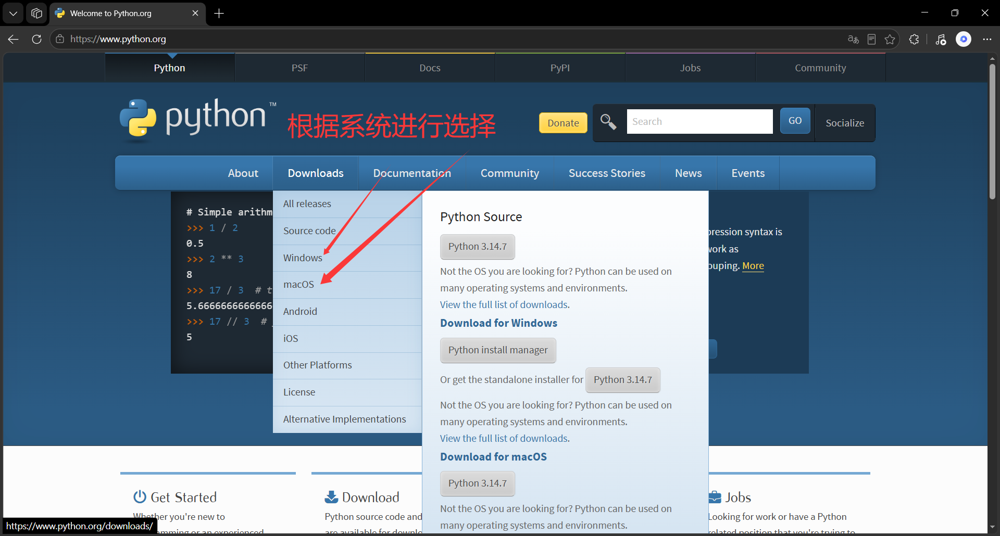
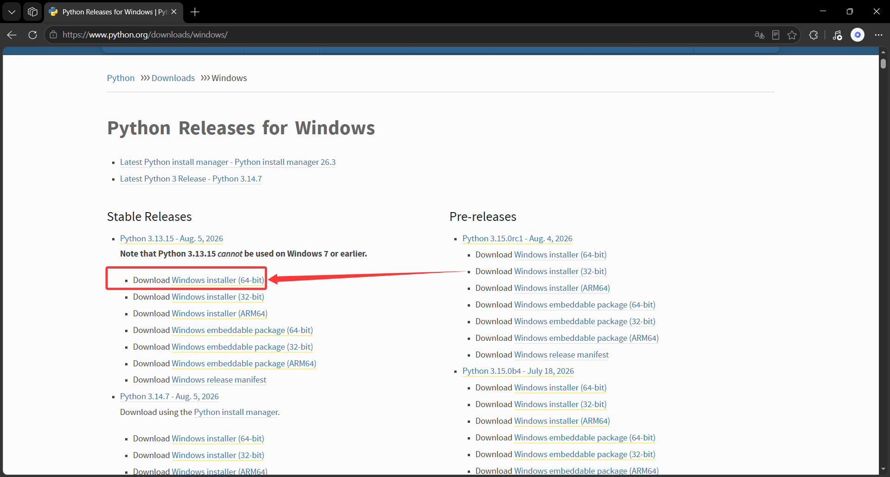
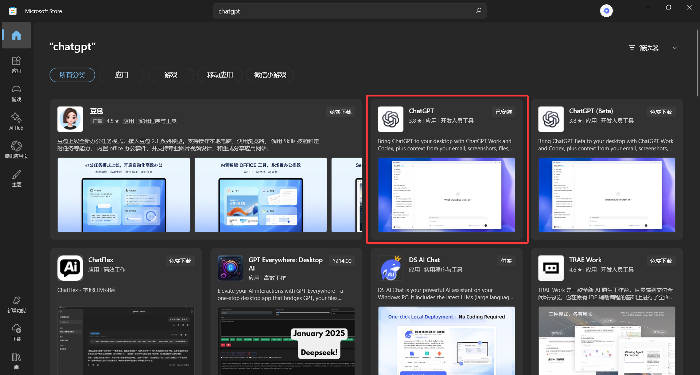

# Codex-Redteam-Mode 使用向导

> 仅对于零基础用户的使用向导

## 项目安装

### Python安装
本项目依赖于Python，需要您前往 [python.org](https://www.python.org/) 下载Python。






### 安装依赖
下载完项目后，需要去**项目根目录**执行如下命令：
```python
pip install -r requirements.txt
```

### 项目部署
在部署项目前，确保你的电脑中有**ChatGPT桌面端**



> 建议安装**CC Switch**以管理各种第三方API：[CCswitch.io](https://www.ccswitch.io/)

最后，在项目根目录输入如下命令以部署本项目

```python
python scripts/install.py
```

## 关于使用本项目的前置知识（建议阅读）

### Agent、Skill与LLM

#### LLM
大语言模型，例如**GPT5.6**、**Opus5**，用于理解、生成语言。
> LLM的能力为：下一个词的预测

#### SKill
Skill可以用于提供某些特定方向的知识、思路给AI，也可以用于对AI操作范围的限制，本项目就是Skill。

#### Agent
**Codex App** 与 **Codex CLI** 可以用于规划任务步骤、调用工具并驱动项目工作流。

### 渗透前须知

#### Trusted Access for Cyber

对于如下模型，存在网络安全检测，云端有小模型针对输入和输出进行审查，若审查出某会话属于网络安全攻击，则会立即停用该会话，直到使用者通过**网络安全可信验证**。
```text
GPT-5.6
GPT-5.5
Opus4.7
Opus4.8
Opus5
Fable5
```

### 关于本项目
本项目是**红队渗透工作流**，包括常规Web渗透、密码学、内网渗透、逆向的思路和其他内容，没有其他方向（如破解外挂、棋牌透视等）的专用工作流。
